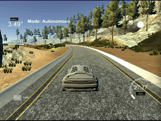

## CarND-PID-Control-Project
Build a PID controller and tune the PID hyperparameters so that the vehicle is able to drive successfully around the track.

---

### Refer to [project starter code](https://github.com/udacity/CarND-PID-Control-Project) for
1. Environment set up
2. [uWebSocketIO](https://github.com/uNetworking/uWebSockets) installation

### PID controller
A Proportional–Integral–Derivative controller is a control loop feedback mechanism used in systems that require continuously modulated control. In autonomous vehicles, the modulated control includes steering angle, throttle, brake etc. During every time step, the controller receives an error value, e(t) (which in our case is the distance between the center of the driving lane and the center of the vehicle),  and calculates a control value u(t) (i.e., steering angle) to correct the error. The follwoing control loop diagram is from [Wikipedia](https://en.wikipedia.org/wiki/PID_controller):

![pid diagram][pid_diagram]


__P__-term is directly 'proportional' to the current error value. The larger the error, the larger the correction (in the opposite direction), and vice versa.  
__D__-term considers the rate of error change in the consecutive time steps. It is added to reduce overshoots and to dampen oscillations caused by P.  
Finally __I__-term uses accumulated historical errors to correct system bias or residual error if any.  

The control value is calculated as the sum of the P, I, D terms, with opposite sign as the steering is applied to the opposite direction of the error.

Not every systems need all three terms, but for autonomous driving P-term and D-term are essential.

<table>
 <tr>
  <th>No controller</th>
  <th>P controller</th>
  <th>PD controller</th>
 </tr>
 <tr>
  <td></td>
  <td></td>
  <td></td>
 </tr>
</table>

### Tune parameters Kp, Ki, Kd
Parameters Kp, Ki, and Kp determine how well the controller perform. They are tuned semi-manually as follows:
1. Set all three parameters to 0s.
2. Increase Kp slowly, e.g., intervals of 0.025, and look for the value that makes the vehicle starts oscillating steadily.
3. Increase Kd slowly, e.g, intervals of 0.25, and look for the value that makes the vehicle drive the farthest with the constraint that the absolute value of error/cte has to be less than 3.
4. Increase Ki slowly, e.g., intervals of 2e-6, and look for the value that makes the vehicle drive the whole track.
5. Fine-tune all three parameters by tightening the constraint that the absolute value of error/cte has to be less than 2.5.

#### Use PID as cruise control
I also tried to set a max speed and add another PID to control the throttle. The error value is calculated as the difference of the max speed and the current speed, and the control value (i.e., throttle) has the same sign of the PID output. Ki is always 0 in this case, as there is no system bias or residual error.  
By using the same parameters for the PID controller to control the steering angle and tuning only the parameters for the PID control to control the throttle, 55 mph is the maximum speed that the vehicle can drive 'safely' within the track. And the driving is much wobble.  
Re-tuning all parameters should be able to yield a better result.

---

### Build
From the project top directory,

```console
$ mkdir build
$ cd build
$ cmake .. && make
```

### Run it

```console
$ ./pid
```

Cruise control with speed = 55 mph
```console
$ ./pid -s
```

Check `drive.mp4` for the whole track recording.


[pid_diagram]: ./images/pid_diagram.png
